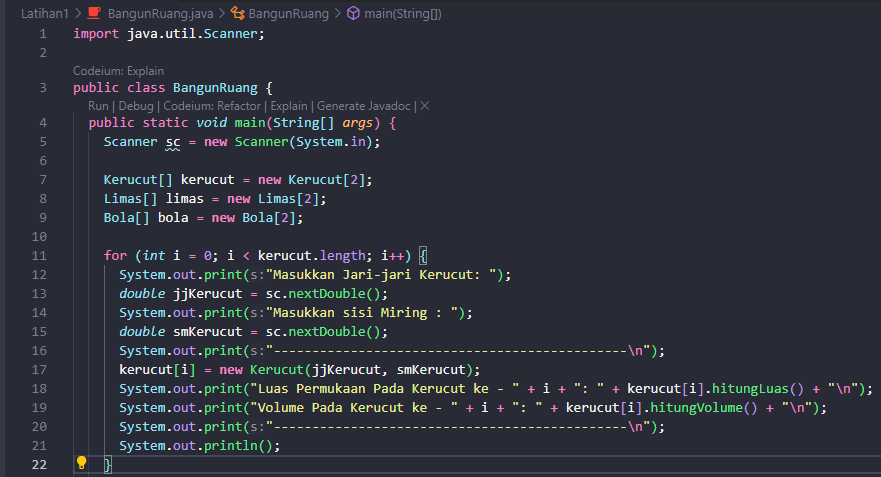

# LAPORAN PRAKTIKUM 3 (JOBSHEET 3)

Nama    : Cakra Wangsa M.A.W

Kelas   : TI-1H

Prodi   : D4 Teknik Informatika

Absen   : 07


### 3.2 Percobaan 1: Membuat Array dari Object, Mengisi dan Menampilkan

### 3.2.1 Langkah-langkah Percobaan

class Persegi panjang 


Array Objects


### 3.2.2 Verifikasi Hasil Percobaan

Run pada kode program


### 3.2.3 Pertanyaan

1. Berdasarkan uji coba 3.2, apakah class yang akan dibuat array of object harus selalu memiliki atribut dan sekaligus method? Jelaskan!

    Jawab: Class yang akan dibuat array of object tidak harus selalu memiliki atribut dan sekaligus method. Class yang akan dibuat array of object hanya perlu memiliki konstruktor yang dapat digunakan untuk membuat objek dari class tersebut.

2. Apakah class PersegiPanjang memiliki konstruktor?Jika tidak, kenapa dilakukan pemanggilan konstruktur pada baris program berikut :
    ``` java
    ppArray[1] = new PersegiPanjang();
    ```

    Jawab:
    
    Tidak, karena sudah memiliki konstruktor pada class PersegiPanjang dan mengapa dipanggil, agar class pada PersegiPanjang bisa terhubung dengan Arrayobjects 

3. Apa yang dimaksud dengan kode berikut ini:

    ``` java
    PersegiPanjang [] ppArray = new PersegiPanjang[3];
    ```

    Jawab: Kode tersebut berfungsi untuk mendeklarasikan dan membuat sebuah array of objects dari class PersegiPanjang dengan panjang 3 elemen.

4. Apa yang dimaksud dengan kode berikut ini:

    ``` java
    ppArray[1] = new PersegiPanjang();
    ppArray[1].panjang = 80;
    ppArray[1].lebar = 40;
    ```

    Jawab: 
    Kode tersebut digunakan untuk membuat sebuah objek dari class PersegiPanjang dan akan menyimpannya ke dalam elemen kedua dari array ppArray, serta mengubah nilai dari atribut panjang dan lebar dari objek tersebut.

5. Mengapa class main dan juga class PersegiPanjang dipisahkan pada uji coba

    Jawab: agar method lebih mudah untuk dikerjakan


### 3.3 Percobaan 2: Menerima Input Isian Array Menggunakan Looping

### 3.3.1 Langkah-langkah Percobaan


### 3.3.2 Verifikasi Hasil Percobaan


### 3.3.3 Pertanyaan

1. Apakah array of object dapat diimplementasikan pada array 2 Dimensi?

    Jawab:
    Bisa
2. Jika jawaban soal no satu iya, berikan contohnya! Jika tidak, jelaskan!

    Jawab:
    

3. Jika diketahui terdapat class Persegi yang memiliki atribut sisi bertipe integer, maka kode dibawah ini akan memunculkan error saat dijalankan. Mengapa?

    Jawab:
    kode tersebut akan mengalami error dikarenakan tidak ada object dari persegi yang diiniliasasikan pada elemen array.

4. Modifikasi kode program pada praktikum 3.3 agar length array menjadi inputan dengan Scanner!

    Jawab:

    


5. Apakah boleh Jika terjadi duplikasi instansiasi array of objek, misalkan saja instansiasi dilakukan pada ppArray[i] sekaligus ppArray[0]?Jelaskan !

    Jawab:
    boleh, tetapi tetap ada resiko jika akan duplikasi instansiasi array karena akan data yang sebelumnya akan berganti dengan data baru


### 3.4 Percobaan 3: Penambahan Operasi Matematika di Dalam Method

### 3.4.1 Langkah-langkah Percobaan

Class Balok


Main ArrayBalok


### 3.4.2 Verifikasi Hasil Percobaan


### 3.4.3 Pertanyaan

1. Dapatkah konstruktor berjumlah lebih dalam satu kelas? Jelaskan dengan contoh!

    Jawab:

    konstruktor dapat berjumlah lebih dalam 1 kelas dengan contoh

    

2. Jika diketahui terdapat class Segitiga seperti berikut ini:
Tambahkan konstruktor pada class Segitiga tersebut yang berisi parameter int a, int t yang masing-masing digunakan untuk mengisikan atribut alas dan tinggi.

    Jawab:

    


3. Tambahkan method hitungLuas() dan hitungKeliling() pada class Segitiga tersebut. Asumsi segitiga adalah segitiga siku-siku. (Hint: Anda dapat menggunakan bantuan library Math pada Java untuk mengkalkulasi sisi miring)

    Jawab:


    

4. Pada fungsi main, buat array Segitiga sgArray yang berisi 4 elemen, isikan masing-masing atributnya sebagai berikut:
sgArray ke-0 alas: 10, tinggi: 4
sgArray ke-1 alas: 20, tinggi: 10
sgArray ke-2 alas: 15, tinggi: 6
sgArray ke-3 alas: 25, tinggi: 10

    Jawab:

    

5. Kemudian menggunakan looping, cetak luas dan keliling dengan cara memanggil method hitungLuas() dan hitungKeliling().

    Jawab:

    input kode program
    

    output kode program
    
    


### 3.5 Latihan Praktikum

1. Buatlah program yang dapat menghitung luas permukaan dan volume bangun ruang kerucut, limas segi empat sama sisi, dan bola. Buatlah 3 (tiga) class sesuai dengan jumlah jenis bangun ruang. Buatlah satu main class untuk membuat array of objects yang menginputkan atribut-atribut yang ada menggunakan konstruktor semua bangun ruang tersebut. Dengan ketentuan,

    a. Buat looping untuk menginputkan masing-masing atributnya, kemudian tampilkan luas permukaan dan volume dari tiap jenis bangun ruang tersebut.

    b. Pada kerucut, inputan untuk atribut hanya jari-jari dan sisi miring

    c. Pada limas segi empat sama sisi, inputan untuk atribut hanya panjang sisi alas dan tinggi limas

    d. Pada bola, inpuntan untuk atribut hanya jari-jari

    Input pada kode program


    
    

    Kerucut
    
    

    Limas
    
    

    Bola
    
    

    Output pada kode program

    


2. Sebuah kampus membutuhkan program untuk menampilkan informasi mahasiswa berupa nama, nim, jenis kelamin dan juga IPK mahasiswa. Program dapat menerima input semua informasi tersebut, kemudian menampilkanya kembali ke user. Implementasikan program tersebut jika dimisalkan terdapat 3 data mahasiswa yang tersedia. Contoh output program:

    

    Input pada kode program

    class

    

    Main

    

    Output pada kode program

    

3. Modifikasi program Latihan no.2 di atas, sehingga bisa digunakan untuk menghitung rata-rata IPK, serta menampilkan data mahasiswa dengan IPK terbesar! (gunakan method untuk masing-masing proses tersebut)


Input pada kode program


class


Main


Output pada kode program


